# Project Background and Objectives
You've joined Pymaceuticals Inc., a burgeoning pharmaceutical company based out of San Diego. Pymaceuticals specializes in anti-cancer pharmaceuticals. In its most recent efforts, it began screening for potential treatments for squamous cell carcinoma (SCC), a commonly occurring form of skin cancer.

As a senior data analyst at the company, you've been given access to the complete data from their most recent animal study. In this study, 250 mice identified with SCC tumor growth were treated through a variety of drug regimens. Over the course of 45 days, tumor development was observed and measured. The purpose of this study was to compare the performance of Pymaceuticals' drug of interest, Capomulin, versus the other treatment regimens. You have been tasked by the executive team to generate all of the tables and figures needed for the technical report of the study. The executive team also has asked for a top-level summary of the study results.

# Observations and Insights (also included at the beginning of jupyter notebook)
• The boxplots I created below show that the Ceftamin drug regimen has the least variability among its final tumor volume data (tumor volume measured on day 45 of the study). However, Capomulin and Ramicane have the lowest final tumor volumes (which is the outcome desired, indicating that tumor has become smaller as a result of the drug treatment) but greater variability. Capomulin and Ramicane had the highest numbers of data points compared to the other drug regimens, which could contribute to the greater variability among their data.

• The linear regression model for Mouse Weight vs. Average Tumor Volume for Capomulin Regimen shows a strong positive linear relationship, with a correlation coefficient of 0.84. Tumor volume increases as mouse weight increases for the mice in this treatment regimen.

• My calculations for IQR and the boxplots I created show no outliers for any of the 4 drug regimens Capomulin, Ramicane, Infubinol, and Ceftamin. This indicates that the data is reliable and all data points can be considered in the data analysis with no reasons to possibly exclude any.

# Screenshots of required output

Summary Statistics table of mean, median, variance, standard deviation, and SEM of the tumor volume for each drug regimen
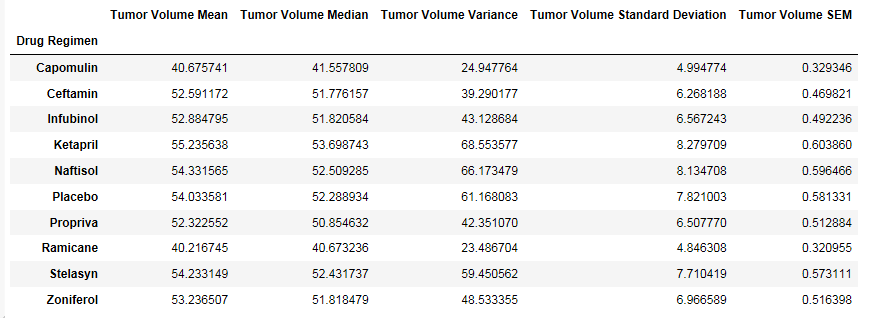

Bar plot using Pandas's DataFrame.plot()

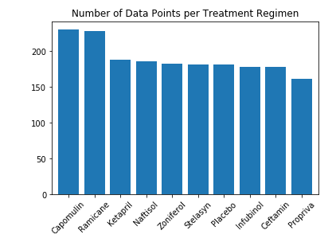

Bar plot using Matplotlib's pyplot

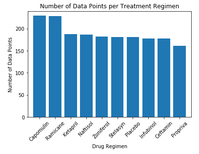

Pie plot using Pandas's DataFrame.plot()

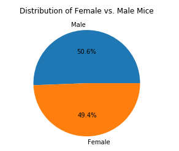

Pie plot using Matplotlib's pyplot

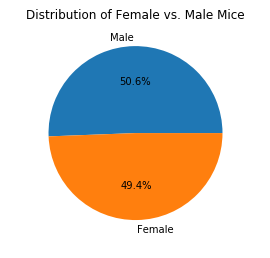

Final tumor volume of each mouse across four of the most promising treatment regimens: Capomulin, Ramicane, Infubinol, and Ceftamin

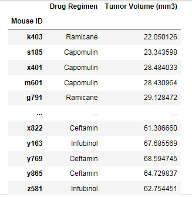

Quartiles and IQR and quantitatively determine if there are any potential outliers across all four treatment regimens
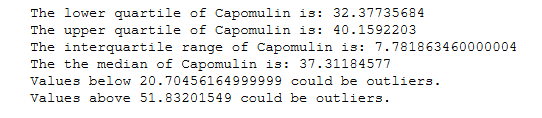
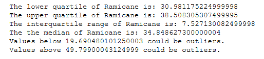
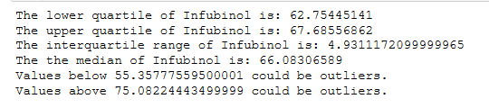
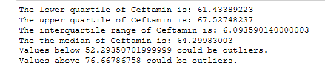

Box and whisker plot of the final tumor volume for all four treatment regimens
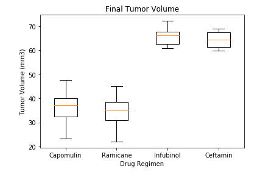

Line plot of time point versus tumor volume for a single mouse treated with Capomulin
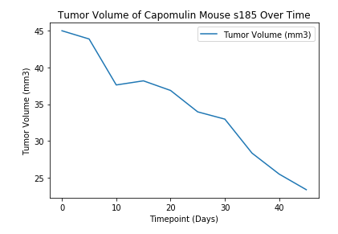

Scatter plot of mouse weight versus average tumor volume for Capomulin
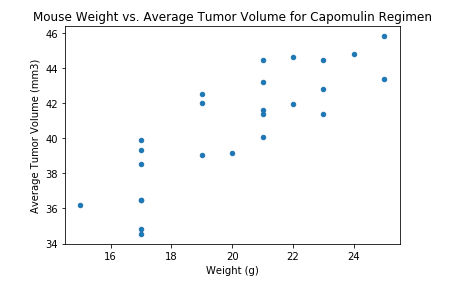

Correlation coefficient between mouse weight and average tumor volume for the Capomulin treatment

Linear regression model between mouse weight and average tumor volume for the Capomulin treatment
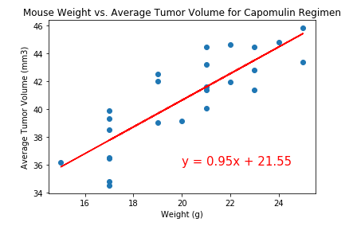
